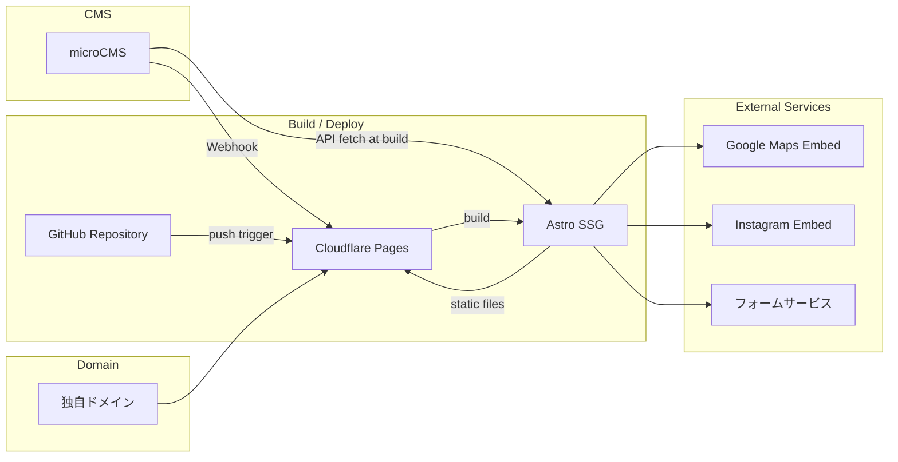
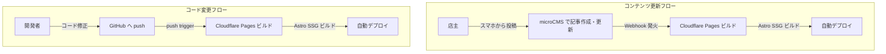

# 要件定義書 - 焙煎工房 函館豆壱 ホームページ

## 1. システム構成

### 1.1 全体構成図



### 1.2 技術スタック

| カテゴリ | 技術 | 選定理由 |
|---|---|---|
| フレームワーク | Astro（SSG モード） | 静的サイト生成による高速配信、コンテンツサイトに最適 |
| ホスティング | Cloudflare Pages | 無料枠で十分、グローバル CDN、高速デプロイ |
| CMS | microCMS | スマホ対応管理画面、Astro との連携実績豊富、無料プランあり |
| スタイリング | Tailwind CSS | ユーティリティファーストで効率的なスタイリング |
| 地図 | Google Maps Embed API | 無料で利用可能、Googleビジネスプロフィールとの連携 |
| フォーム | Cloudflare Pages Functions or Formspree | サーバーレスでのフォーム送信処理 |
| ドメイン管理 | Cloudflare | ホスティングと統合管理、DNS 設定の簡素化 |
| バージョン管理 | GitHub | Cloudflare Pages との自動連携 |

---

## 2. 機能要件

### 2.1 ページ構成と機能詳細

#### 2.1.1 トップページ

| 項目 | 内容 |
|---|---|
| URL | `/` |
| データソース | 静的 + microCMS（お知らせ） |
| 主な表示要素 | ヒーローセクション（キャッチコピー + メインビジュアル）、お店の紹介（概要）、おすすめ・新着の豆（数件ピックアップ）、最新のお知らせ（数件）、Instagram 埋め込み、アクセス情報（簡易）、各ページへの CTA |
| レスポンシブ | モバイルファースト、シングルカラムレイアウト中心 |

#### 2.1.2 お店について

| 項目 | 内容 |
|---|---|
| URL | `/about` |
| データソース | 静的 |
| 主な表示要素 | お店のコンセプト・ストーリー、豆の仕入れ・選定のこだわり、焙煎へのこだわり、函館との関わり・地域性、店舗の外観・内観写真 |

#### 2.1.3 取扱い豆一覧

| 項目 | 内容 |
|---|---|
| URL | `/beans` |
| データソース | microCMS |
| 主な表示要素 | 豆の一覧（カード形式）、各豆の詳細情報（名前・産地・焙煎度・特徴・価格帯・画像）、フィルタリング機能（焙煎度、おすすめ、季節限定など）、個別詳細ページ（`/beans/[id]`） |
| 更新頻度 | 随時（店主が microCMS から更新） |

#### 2.1.4 アクセス・店舗情報

| 項目 | 内容 |
|---|---|
| URL | `/access` |
| データソース | 静的 |
| 主な表示要素 | 店舗名・住所・電話番号、営業時間（曜日別）、定休日、Google Maps 埋め込み、最寄り駅からの道案内、駐車場情報（なし、近隣コインパーキングの案内等） |

**掲載する店舗情報:**

| 項目 | 内容 |
|---|---|
| 店名 | 焙煎工房 函館豆壱 |
| 住所 | 〒040-0011 北海道函館市本町31-35 |
| 電話番号 | 0138-83-1826 |
| アクセス | 函館市電2系統 中央病院前駅 徒歩3分 |
| 駐車場 | なし |

**営業時間:**

| 曜日 | 時間 |
|---|---|
| 月曜日 | 10:00〜19:00 |
| 火曜日 | 定休日 |
| 水曜日 | 定休日 |
| 木曜日 | 10:00〜19:00 |
| 金曜日 | 10:00〜19:00 |
| 土曜日 | 10:00〜18:00 |
| 日曜日 | 10:00〜18:00 |

#### 2.1.5 お知らせ

| 項目 | 内容 |
|---|---|
| URL | `/news`（一覧）、`/news/[id]`（詳細） |
| データソース | microCMS |
| 主な表示要素 | 記事一覧（タイトル・公開日・サムネイル・カテゴリ）、記事詳細（タイトル・本文・画像・公開日）、ページネーション |
| 更新頻度 | 毎営業日（店主が microCMS から更新） |

#### 2.1.6 ギャラリー

| 項目 | 内容 |
|---|---|
| URL | `/gallery` |
| データソース | microCMS |
| 主な表示要素 | 写真のグリッド表示、ライトボックス（拡大表示）、キャプション |
| 更新頻度 | 随時（店主が microCMS から更新） |

#### 2.1.7 お問い合わせ

| 項目 | 内容 |
|---|---|
| URL | `/contact` |
| データソース | 静的（フォーム） |
| フォーム項目 | お名前（必須）、メールアドレス（必須）、お問い合わせ内容（必須） |
| 送信先 | 店舗メールアドレスへ転送 |
| 機能 | 入力バリデーション、送信完了画面、スパム対策（reCAPTCHA 等） |

#### 2.1.8 共通コンポーネント

**ヘッダー:**
- ロゴ（準備でき次第差し替え）
- ナビゲーションメニュー（トップ / お店について / 豆一覧 / アクセス / お知らせ / ギャラリー / お問い合わせ）
- モバイル時：ハンバーガーメニュー

**フッター:**
- 店舗情報（店名・住所・電話番号・営業時間）
- SNS リンク（Instagram・Facebook）
- 著作権表示

---

### 2.2 SNS 連携

| 機能 | 詳細 |
|---|---|
| Instagram 埋め込み | トップページに最新投稿を埋め込み表示 |
| SNS リンク | ヘッダーまたはフッターに Instagram・Facebook へのリンクアイコンを設置 |
| OGP 設定 | 各ページに適切な OGP メタタグを設定し、SNS シェア時のプレビューを最適化 |

### 2.3 お問い合わせフォーム

| 項目 | 詳細 |
|---|---|
| フォーム項目 | お名前（text, 必須）、メールアドレス（email, 必須）、お問い合わせ内容（textarea, 必須） |
| バリデーション | クライアントサイド + サーバーサイド |
| スパム対策 | reCAPTCHA v3 またはハニーポット方式 |
| 送信処理 | Cloudflare Pages Functions または Formspree |
| 送信完了 | 完了メッセージ表示、入力者への自動返信メール（任意） |

---

## 3. microCMS スキーマ設計

### 3.1 お知らせ API（リスト形式）

API名: `news`

| フィールド ID | 表示名 | 種類 | 必須 | 備考 |
|---|---|---|:---:|---|
| title | タイトル | テキストフィールド | ○ | |
| body | 本文 | リッチエディタ | ○ | 画像挿入可 |
| thumbnail | サムネイル | 画像 | | 一覧表示用 |
| category | カテゴリ | セレクトフィールド | | 新着豆 / イベント / 営業案内 / その他 |

### 3.2 取扱い豆 API（リスト形式）

API名: `beans`

| フィールド ID | 表示名 | 種類 | 必須 | 備考 |
|---|---|---|:---:|---|
| name | 豆の名前 | テキストフィールド | ○ | |
| description | 説明 | テキストエリア | ○ | 風味・特徴の説明 |
| origin | 産地 | テキストフィールド | ○ | 国名・地域名 |
| roastLevel | 焙煎度 | セレクトフィールド | ○ | 浅煎り / 中煎り / 中深煎り / 深煎り |
| priceRange | 価格帯 | テキストフィールド | | 例: 「100g ○○円〜」 |
| image | 画像 | 画像 | | 豆の写真 |
| isRecommended | おすすめ | 真偽値 | | トップページへのピックアップ用 |
| isSeasonal | 季節限定 | 真偽値 | | 季節限定ラベル表示用 |
| sortOrder | 表示順 | 数値 | | 一覧での並び順制御 |

### 3.3 ギャラリー API（リスト形式）

API名: `gallery`

| フィールド ID | 表示名 | 種類 | 必須 | 備考 |
|---|---|---|:---:|---|
| image | 画像 | 画像 | ○ | |
| caption | キャプション | テキストフィールド | | 写真の説明 |
| sortOrder | 表示順 | 数値 | | ギャラリーでの並び順制御 |

---

## 4. 非機能要件

### 4.1 パフォーマンス

| 項目 | 目標 |
|---|---|
| Lighthouse Performance | 90 以上 |
| Lighthouse Accessibility | 90 以上 |
| Lighthouse Best Practices | 90 以上 |
| Lighthouse SEO | 90 以上 |
| 初回表示速度（LCP） | 2.5 秒以内 |
| 累積レイアウトシフト（CLS） | 0.1 以下 |

Astro の SSG による静的ファイル配信と Cloudflare CDN により、高いパフォーマンスを実現する。画像は適切なフォーマット（WebP）とサイズに最適化する。

### 4.2 SEO

#### メタ情報

- 各ページに固有の title タグと meta description を設定
- OGP タグ（og:title, og:description, og:image, og:url）を全ページに設定
- Twitter Card メタタグを設定
- canonical URL を設定

#### 構造化データ

- LocalBusiness スキーマ（店舗情報）
- BreadcrumbList スキーマ（パンくずリスト）

#### サイトマップ・robots

- `sitemap.xml` を自動生成
- `robots.txt` を適切に設定

#### SEO キーワード戦略

| 分類 | キーワード |
|---|---|
| 主要 | 函館 コーヒー豆 / 函館 自家焙煎 / 函館 珈琲豆 販売 |
| 補助 | 函館 スペシャルティコーヒー / 函館 コーヒー豆 専門店 / 函館 焙煎工房 |
| 地域 | 函館市本町 コーヒー / 中央病院前 コーヒー |
| ブランド | 函館豆壱 / 焙煎工房 函館豆壱 |

### 4.3 アクセシビリティ

- セマンティック HTML の使用（header, nav, main, footer, article, section 等）
- 全画像に alt 属性を設定
- キーボード操作によるナビゲーション対応
- 十分なコントラスト比の確保
- フォームのラベル・エラーメッセージの適切な設定

### 4.4 セキュリティ

- お問い合わせフォームのスパム対策（reCAPTCHA 等）
- 適切な HTTP セキュリティヘッダーの設定
- HTTPS の強制（Cloudflare にて対応）

### 4.5 保守性・拡張性

- コンポーネント指向の設計により再利用性を高める
- 将来の EC 機能追加を見据え、商品データは構造化して管理する
- Astro のアイランドアーキテクチャにより、必要に応じてインタラクティブなコンポーネントを追加可能

### 4.6 ブラウザ対応

| ブラウザ | バージョン |
|---|---|
| Chrome | 最新2バージョン |
| Safari | 最新2バージョン（iOS 含む） |
| Firefox | 最新2バージョン |
| Edge | 最新2バージョン |

スマートフォン（iOS / Android）での表示を最優先とする。

---

## 5. デザイン仕様

### 5.1 カラーパレット

| 用途 | カラー | 備考 |
|---|---|---|
| 背景（メイン） | ホワイト系（#FFFFFF〜#FAFAFA） | クリーンな印象 |
| 背景（セクション） | ライトグレー系（#F5F5F5） | セクション区切り |
| テキスト（メイン） | ダークグレー〜ブラック（#333333） | 可読性重視 |
| テキスト（サブ） | ミディアムグレー（#666666） | 補足情報 |
| アクセント | コーヒーブラウン系（#6F4E37〜#8B6914） | CTA、見出し、ポイント |
| アクセント（ホバー） | ダークブラウン系 | インタラクション |

### 5.2 タイポグラフィ

- 日本語: ゴシック体系（Noto Sans JP 等）
- 英語: サンセリフ系
- 見出しは適切なウェイト・サイズでメリハリをつける

### 5.3 レイアウト方針

- モバイルファーストのレスポンシブデザイン
- 最大コンテンツ幅: 1200px 程度
- 余白を十分にとり、ゆとりのあるレイアウト
- 写真を効果的に活用し、コーヒーの世界観を演出

---

## 6. デプロイ・運用フロー

### 6.1 デプロイフロー



### 6.2 運用フロー

1. **日常更新（店主）**: microCMS アプリ（スマホ）→ 記事・豆情報を入力 → 公開ボタン → 自動でサイト更新
2. **コード修正（開発者）**: ローカル開発 → GitHub push → 自動ビルド・デプロイ
3. **プレビュー**: microCMS のプレビュー機能および Cloudflare Pages のプレビューデプロイで公開前確認

---

## 7. ディレクトリ構成（想定）

```
mameichi-hp/
├── doc/                          # ドキュメント
├── src/
│   ├── components/               # 共通コンポーネント
│   │   ├── Header.astro
│   │   ├── Footer.astro
│   │   ├── BeanCard.astro
│   │   ├── NewsCard.astro
│   │   └── ...
│   ├── layouts/                  # レイアウト
│   │   └── BaseLayout.astro
│   ├── pages/                    # ページ（日本語）
│   │   ├── index.astro
│   │   ├── about.astro
│   │   ├── beans/
│   │   │   ├── index.astro
│   │   │   └── [id].astro
│   │   ├── access.astro
│   │   ├── news/
│   │   │   ├── index.astro
│   │   │   └── [id].astro
│   │   ├── gallery.astro
│   │   └── contact.astro
│   ├── lib/                      # ユーティリティ
│   │   └── microcms.ts           # microCMS API クライアント
│   └── styles/                   # グローバルスタイル
│       └── global.css
├── public/                       # 静的アセット
│   ├── favicon.ico
│   └── images/
├── astro.config.mjs
├── tailwind.config.mjs
├── package.json
└── README.md
```

---

## 8. 外部サービス設定

### 8.1 microCMS

- アカウント作成・サービス作成
- API スキーマ設定（3.1〜3.3 に準拠）
- Webhook 設定（Cloudflare Pages の Deploy Hook URL を登録）
- API キーの発行・環境変数への設定

### 8.2 Cloudflare Pages

- GitHub リポジトリとの連携
- ビルドコマンド: `npm run build`
- 出力ディレクトリ: `dist`
- 環境変数設定（microCMS API キー等）
- カスタムドメイン設定
- Deploy Hook の作成（microCMS Webhook 用）

### 8.3 Google Maps

- Google Maps Embed API の利用（API キー不要の iframe 埋め込み）
- Googleビジネスプロフィールの URL を利用

### 8.4 独自ドメイン

- ドメイン取得（Cloudflare Registrar 推奨）
- Cloudflare Pages へのカスタムドメイン設定
- SSL 証明書（Cloudflare が自動発行）
